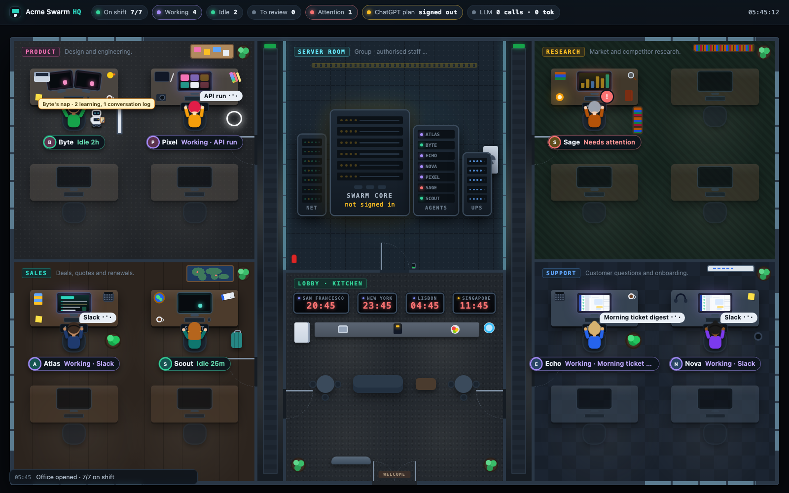

<p align="center">
  <picture>
    <source media="(prefers-color-scheme: dark)" srcset="docs/brand/logo-dark.svg">
    
  </picture>
</p>

**Run a team of AI agents like a small company.** Stormo takes your organisation's agents, defined
as plain files in git, runs them on your laptop or on AWS, watches them work, and turns what they
learn on the job into reviewed changes you can merge.



*The office, served by `stormo core`: each unit is a room, each agent sits at a desk dressed for its
role, and the name tags say what it is doing right now (a Slack turn, a scheduled job, idle). The
little robot carries each agent's latest snapshot back to the server room and notes what changed.
This one is the bundled demo (`go run ./examples/office-demo`), a made-up company with simulated
activity.*

## What it does

- **Agents as files.** An *instance* is one organisation's directory: `stormo.yaml`, units, agents
  (manifest, personality, skills, schedules), personas and bridge actions. It versions, reviews and
  moves like any other repo ([docs/instances.md](docs/instances.md)).
- **One place at a time, anywhere.** The same agent runs in a local Docker Compose project or as
  an ECS task, and `stormo handoff` moves it between the two with its memory, skills and history
  (never its credentials).
- **Learning you can review.** Sidecars snapshot what each agent learns ("naps"). A dream folds
  the naps into a ledger of proposed lessons and skill changes, scrubbed of personal data, for a
  person to accept, reject or promote to the whole unit. Accepted lessons ship with the next build.
- **Isolation by design.** Agents see only their unit's lessons, documents and bridge actions, plus
  what is shared group-wide. Secrets are names in git and values in one local file or AWS Secrets
  Manager.
- **A control plane with a face.** `stormo core` serves the office above, one ChatGPT-plan model
  gateway for every local agent, and the fleet's status.
- **Pluggable engine.** Agents run on [Hermes](https://hermes-agent.nousresearch.com/docs/) today,
  behind an interface built for more.

Stormo is a single Go binary: the CLI you run, the core service, and the sidecar inside every
agent's task.

## Quick start

Download the archive for your platform from [Releases](https://github.com/camfinc/stormo/releases)
(Linux and macOS, amd64 and arm64), check it against `SHA256SUMS`, and put `stormo` on your PATH.
A released binary pulls its matching sidecar image, `ghcr.io/camfinc/stormo-sidecar:<version>`, the
first time it starts an agent. Or build from source:

```sh
git clone https://github.com/camfinc/stormo.git && cd stormo
go build -o bin/stormo ./cmd/stormo          # Go 1.26
ln -s "$PWD/bin/stormo" ~/.local/bin/stormo  # anywhere on your PATH

go run ./examples/office-demo                # the office above, at http://127.0.0.1:18700/
```

A source build makes its own sidecar image from `docker/sidecar.Dockerfile` when it first needs one.

Then make it yours. Copy the example instance, describe your organisation and its first agent,
and start it:

```sh
cp -R examples/minimal ~/acme && cd ~/acme && git init
$EDITOR stormo.yaml units/ agents/
stormo check                # validate and compile every agent
stormo secrets init         # secrets.local.yaml (gitignored, 0600): fill in the values
stormo start                # build, then run every agent locally (Docker compose v2: OrbStack, Docker Desktop, Linux)
stormo core up              # the office and the model gateway on http://127.0.0.1:18600/
```

Stormo finds the instance from the current directory (or `--instance <dir>`, or
`STORMO_INSTANCE`). Vendoring the engine inside the instance as a git submodule keeps both in step
([docs/instances.md](docs/instances.md)).

## Use it from Claude Code or Codex

Stormo can install itself as an agent skill, so Claude Code and Codex know how to operate an
instance: what is safe to run, what needs your go, and every command.

```sh
stormo skill install                    # for you: ~/.claude/skills/stormo and ~/.agents/skills/stormo
stormo skill install --scope project    # for one instance or repo: its .claude/skills and .agents/skills
stormo skill install --for codex        # one tool only; `stormo skill uninstall` and `skill show` too
```

Running sessions pick the skill up without a restart. Reinstalling after an upgrade refreshes it;
a skill named `stormo` that Stormo did not write is left alone unless you pass `--force`.

## How it fits together

```
 instance (git)                    stormo                          where agents run
 ──────────────                    ──────                          ────────────────
 stormo.yaml, units/, agents/ ──▶ build ─▶ baseline ───────────▶ local compose │ ECS task
                                                                  rehydrate ─▶ agent ◀─ nap
 learnings/ledger.jsonl  ◀── review ◀── dream ◀── naps (dir or S3) ◀────────────────┘
```

- **Build** compiles an agent for its engine: personality, skills, schedules, config, and the
  lessons a reviewer accepted.
- **Rehydrate** starts every task from that baseline plus its latest nap; **nap** keeps snapshotting
  while it runs and once more on shutdown.
- **Dream** reads only what an agent learned (never its conversations) and proposes it back.

The design in depth: [ARCHITECTURE.md](ARCHITECTURE.md). The core and the office:
[docs/core.md](docs/core.md).

## Everyday commands

| | |
|---|---|
| `stormo` | status of every agent: state, last nap, lessons waiting for review |
| `stormo start` · `stop` · `restart [agent…]` | local by default; `-r` targets ECS (remote changes ask first) |
| `stormo handoff <agent> --to remote` | stop here, carry the latest nap over, start there |
| `stormo logs <agent> -f` · `chat <agent> "hello"` | follow an agent, or talk to its local API |
| `stormo learn [agent…]` | nap now, fold naps into proposals, show what to review |
| `stormo learn list` · `accept` · `reject` · `promote` | review lessons; `learn skills` for skill proposals |
| `stormo inspect <agent>` | everything the engine computes for an agent, as JSON |
| `stormo bench <agent>` | scenario checks, mocked or against the real engine image |
| `stormo review` | a read-only health sweep of the local fleet |
| `stormo core up` · `status` · `login` | the office, the model gateway, the ChatGPT sign-in |
| `stormo skill install` | teach Claude Code and Codex to operate Stormo |

`stormo --help` lists everything; `swarm` works as a second name for the binary.

## Shipping to AWS

```sh
stormo secrets push [agent…]         # key-name diff against Secrets Manager; --yes writes
stormo deploy render-shared          # one-time EFS setup for the shared document space
stormo deploy render <agent>         # task definition + task role policy, and the aws commands
stormo build <agent>                 # then one sidecar image per agent, from the instance:
docker build -f <engine>/docker/instance.Dockerfile --build-arg STORMO_IMAGE=stormo-sidecar:<version> \
  --build-arg AGENT=<agent> --platform linux/arm64 -t <registry>/<names.resource>-<agent>:<tag> .
```

Rendering never calls AWS. Registering task definitions and creating services, buckets or secrets
stays a human step.

## Repository

```
cmd/stormo/          the CLI
pkg/                 the engine (instance, manifests, build, learning loop, core, deploy, …)
docker/              the sidecar image and the per-agent ECS layer
examples/minimal/    a complete example instance: the template and the test fixture
examples/office-demo the office with simulated activity (the screenshot above)
docs/                instances, the core and the office; docs/brand: the logo
tools/brandgen/      generates the logo files
scripts/             release builds
.github/workflows/   CI and releases
```

## Develop

```sh
gofmt -l . && go vet ./... && go test ./...
go build -o bin/stormo ./cmd/stormo && bin/stormo --instance examples/minimal check
```

CI runs the same checks on every push and pull request. To release, tag a commit on `main`:

```sh
git tag v0.1.0 && git push origin v0.1.0
```

The release workflow tests the tag, attaches `stormo_<version>_<os>_<arch>.tar.gz` for each platform
with `SHA256SUMS` (built by `scripts/release-build.sh`, which also runs locally), and publishes the
multi-arch sidecar image. A tag with a suffix (`v0.2.0-rc.1`) becomes a pre-release.

Contributor notes, including how dependencies are pinned: [CLAUDE.md](CLAUDE.md).

## License

Apache License 2.0: [LICENSE](LICENSE). Copyright 2026 CAMF Solutions Inc. ([NOTICE](NOTICE)).
